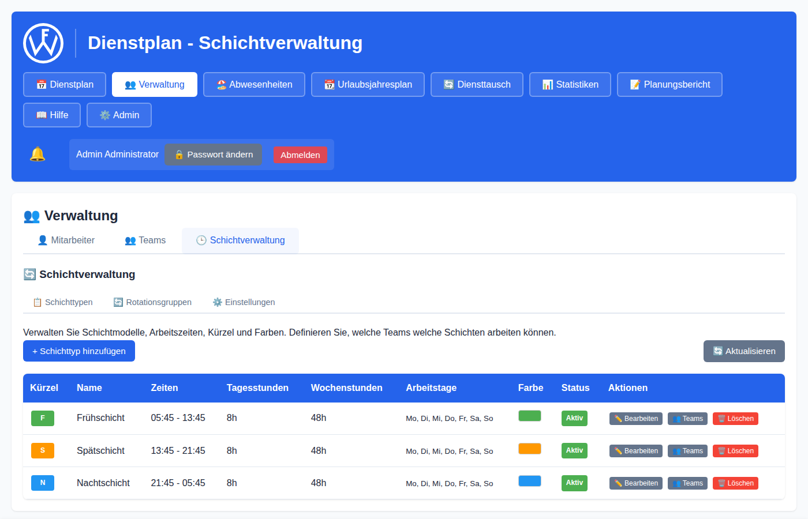
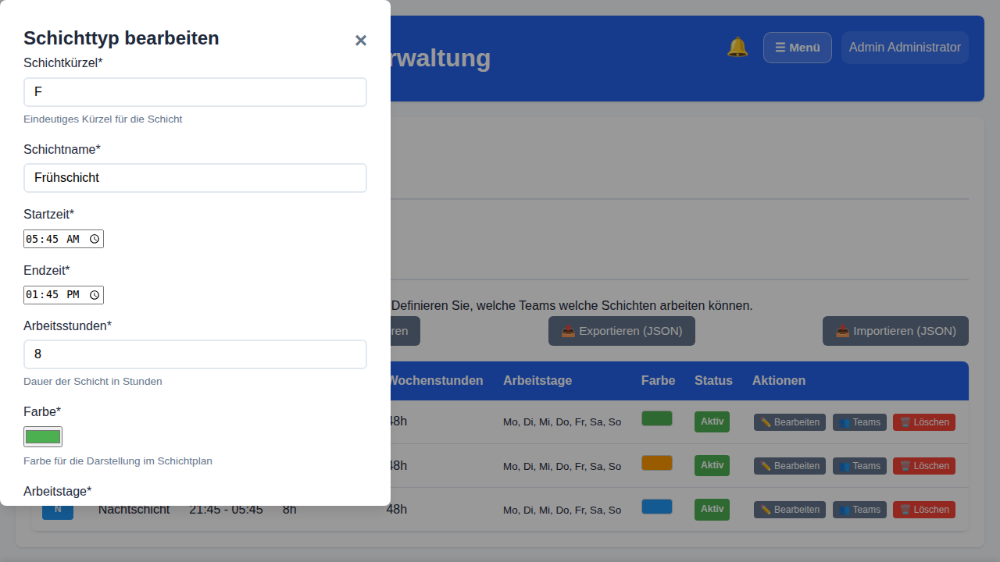
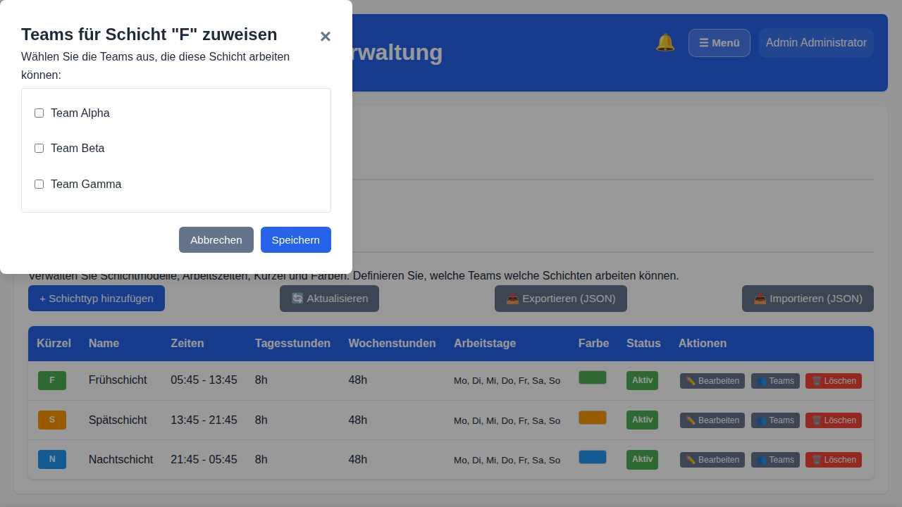
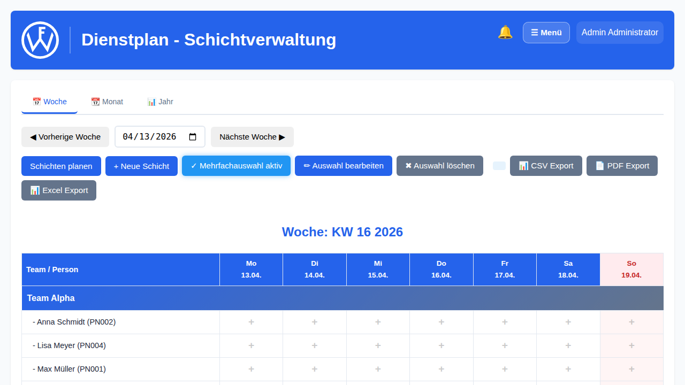
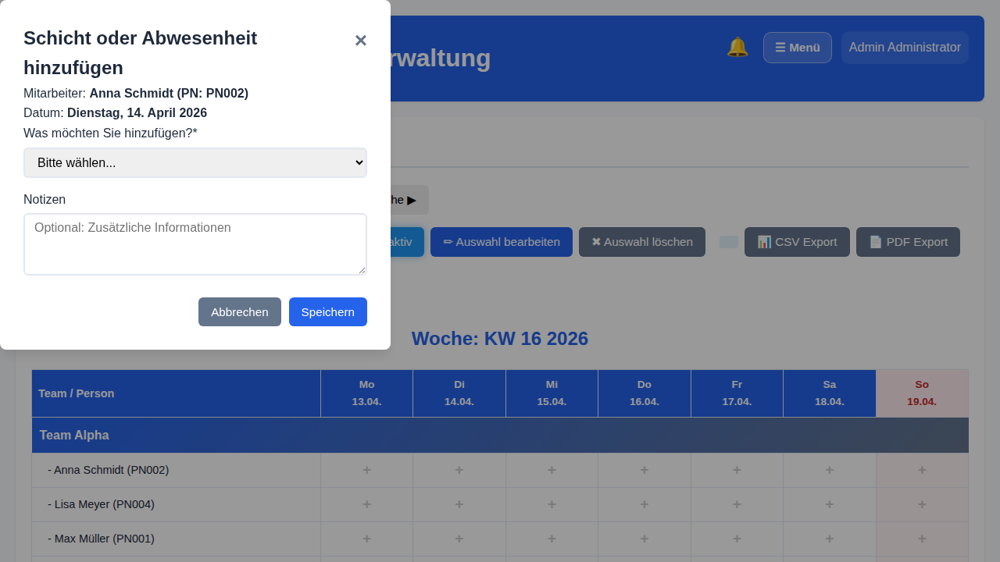
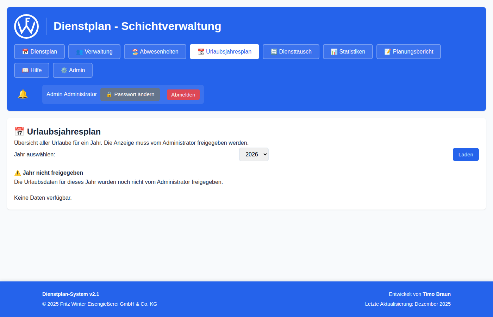
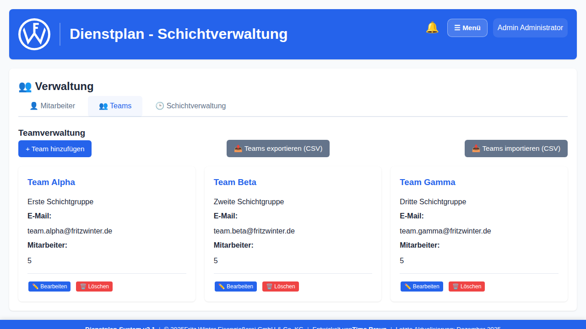
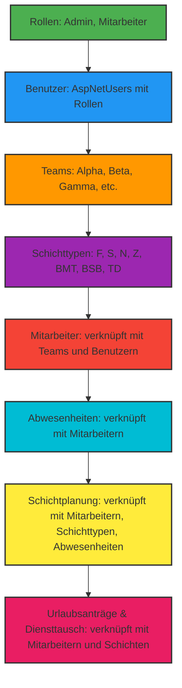
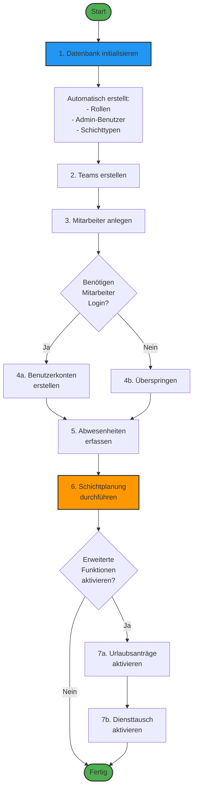

# Dienstplan - Automatisches Schichtverwaltungssystem

**Version 2.0 - Python Edition** | Entwickelt von Timo Braun

Ein flexibles System zur Verwaltung und automatischen Planung von Schichtdiensten für Unternehmen jeder Größe. Powered by **Google OR-Tools** Constraint-Solver für optimale Schichtverteilung.

**Flexibel skalierbar**: Das System unterstützt beliebige Anzahlen von Mitarbeitern und Teams - nicht nur auf 17 Mitarbeiter in 3 Teams beschränkt.


---

## 📑 Inhaltsverzeichnis

- [🎯 Funktionsumfang](#-funktionsumfang)
- [📸 Screenshots](#-screenshots)
- [🏗️ Architektur](#%EF%B8%8F-architektur)
- [🚀 Installation & Ausführung](#-installation--ausführung)
- [📖 API-Dokumentation](#-api-dokumentation)
- [🔧 Konfiguration](#-konfiguration)
- [🧪 Tests](#-tests)
- [🔐 Sicherheit & Authentifizierung](#-sicherheit--authentifizierung)
- [🐳 Deployment](#-deployment)
- [🛠️ Entwicklung](#%EF%B8%8F-entwicklung)
- [🤝 Beitragen](#-beitragen)
- [📊 Migration von .NET zu Python](#-migration-von-net-zu-python)
- [📚 Dokumentation](#-dokumentation)
- [📄 Lizenz](#-lizenz)
- [🙋 Support & Kontakt](#-support--kontakt)

---

## 🎯 Funktionsumfang

### Mitarbeiterverwaltung
- **Pflichtfelder**: Vorname, Name, Personalnummer
- **Erweiterte Daten**: Geburtsdatum, Funktion (z.B. Brandmeldetechniker, Brandschutzbeauftragter)
- **Teamzuordnung**: Mitarbeiter können Teams zugeordnet werden
- **Dynamische Vertretung**: System stellt sicher, dass jede Woche mindestens ein Mitarbeiter aus Schicht-Teams komplett frei ist für flexible Vertretung bei Ausfällen
- **Ferienjobber**: Unterstützung für temporäre Mitarbeiter (meist in Sommerferien)
- **Abwesenheiten**: Verwaltung von Krank, Urlaub, Lehrgang
- **Dynamische Arbeitszeitregeln**: Arbeitszeiten werden aus der Schichtverwaltung berechnet
  - Jede Schicht definiert ihre Wochenarbeitszeit (z.B. 40 oder 48 Stunden)
  - Monatsarbeitszeit ergibt sich automatisch aus Wochenarbeitszeit × 4
  - Keine festen globalen Limits - flexibel konfigurierbar pro Schicht

### Urlaubsverwaltung
- **Urlaubsanträge**: Mitarbeiter können Urlaubswünsche einreichen
- **Status-Workflow**: In Bearbeitung → Genehmigt/Nicht genehmigt
- **Bearbeitung**: Admin kann Anträge genehmigen oder ablehnen
- **Automatische Umwandlung**: Genehmigte Anträge werden automatisch zu Abwesenheiten
- **Statusverfolgung**: Mitarbeiter können den Status ihrer Anträge einsehen

### Diensttausch-System
- **Dienste anbieten**: Mitarbeiter können einzelne Dienste zum Tausch anbieten
- **Tauschangebote annehmen**: Andere Mitarbeiter können Dienste anfragen
- **Genehmigungspflicht**: Alle Tausche müssen vom Admin genehmigt werden
- **Automatische Umschichtung**: Nach Genehmigung wird der Dienst automatisch umgetauscht
- **Nachverfolgung**: Vollständige Historie aller Tauschangebote

### Schichtarten
Schichttypen werden flexibel durch die **Schichtverwaltung im Admin-Bereich** konfiguriert. Administratoren können eigene Schichttypen mit individuellen Arbeitszeiten, Arbeitstagen und Wochenarbeitsstunden definieren.

**Standard-Schichttypen** (Beispiele, anpassbar):
- **Früh (F)**: 05:45–13:45 Uhr
- **Spät (S)**: 13:45–21:45 Uhr
- **Nacht (N)**: 21:45–05:45 Uhr
- **Zwischendienst (Z)**: 08:00–16:00 Uhr
- **Brandmeldetechniker (BMT)**: 06:00-14:00 Uhr (Mo-Fr)
- **Brandschutzbeauftragter (BSB)**: 07:00-16:30 Uhr (Mo-Fr, 9,5 Stunden)
- **Tagdienst (TD)**: Speziell für qualifizierte Mitarbeiter
- **Abwesenheiten**: AU (Arbeitsunfähigkeit/Krank), U (Urlaub), L (Lehrgang)

**Navigation zur Schichtverwaltung:** Nach Login als Admin → **Administration** → **Schichtverwaltung**

### Schichtbesetzung
Besetzungsanforderungen werden über die **Schichtverwaltung im Admin-Bereich** konfiguriert. Jede Schicht kann individuelle Mindest- und Maximalbesetzungen für verschiedene Wochentage definieren.

### Automatische Schichtplanung mit OR-Tools
Das System verwendet **Google OR-Tools CP-SAT Solver** für optimale Schichtplanung und beachtet folgende Regeln:

**Harte Constraints (müssen eingehalten werden):**
- ✅ Nur 1 Schicht pro Mitarbeiter und Tag
- ✅ Keine Arbeit während Abwesenheit
- ✅ Mindestbesetzung für alle Schichten
- 🚫 Verbotene Wechsel: Spät → Früh, Nacht → Früh
- ⏰ Gesetzliche Ruhezeiten (11 Stunden Minimum)
- 📊 Maximal 6 aufeinanderfolgende Schichten
- 🌙 Maximal 5 aufeinanderfolgende Nachtschichten
- ⏱️ Dynamische Arbeitszeitgrenzen basierend auf Schichtkonfiguration
  - Wöchentliche Arbeitszeit: aus Schicht-Definition (z.B. 40 oder 48h)
  - Monatliche Arbeitszeit: Wöchentliche Arbeitszeit × 4
- 🔧 Jede Woche mindestens 1 Mitarbeiter aus Schicht-Teams komplett frei für dynamische Vertretung
- 🎯 1 BMT (Brandmeldetechniker) pro Werktag
- 🎯 1 BSB (Brandschutzbeauftragter) pro Werktag

**Weiche Constraints (werden optimiert):**
- ⚖️ Gleichmäßige Schichtverteilung über alle Mitarbeiter
- 🔄 Bevorzugter Rhythmus: Früh → Nacht → Spät
- 📊 Faire Workload-Verteilung
- 🏖️ Faire Wochenendverteilung innerhalb jedes Teams (hohe Priorität)

### Dashboard & Statistiken
- 📊 Arbeitsstunden pro Mitarbeiter
- 📈 Schichtverteilung pro Team
- 📅 Fehltageübersicht
- 💼 Team-Workload Analyse
- 📆 Samstags-/Sonntagsdienste je Mitarbeiter (Nur Admin)

### Änderungsverfolgung
- 📝 Jede Schichtänderung wird protokolliert
- 👤 Wer hat die Änderung vorgenommen?
- 🕐 Wann wurde die Änderung vorgenommen?

### Web-Schnittstelle
- 📱 Responsive Design (Desktop & Smartphone)
- 📆 Ansichten: Woche, Monat, Jahr
- 🔐 Authentifizierung und Autorisierung
- 👀 Lesezugriff für alle Mitarbeiter
- ⚡ Performante REST API

## 📸 Screenshots

### Anmeldung

*Sichere Anmeldung mit Rollenbasierter Zugriffskontrolle (Admin, Mitarbeiter)*

### Dienstplan-Ansicht (Woche) - Administrator

*Wochenansicht mit vollem Funktionsumfang nach Administrator-Anmeldung*

### Dienstplan-Ansicht (Monat)

*Monatsansicht für besseren Überblick über längere Zeiträume*

### Dienstplan-Ansicht (Jahr)

*Jahresansicht für die Langzeitplanung*

### Mitarbeiterverwaltung

*Übersicht aller Mitarbeiter mit Teams und Personalnummern*

### Urlaubsverwaltung

*Verwaltung von Urlaubsanträgen mit Status-Workflow (In Bearbeitung, Genehmigt, Nicht genehmigt)*

### Diensttausch-System

*Mitarbeiter können Dienste zum Tausch anbieten - Genehmigung durch Admin erforderlich*

### Statistiken & Auswertungen

*Umfassende Statistiken über Arbeitsstunden, Schichtverteilung, Fehltage und Team-Auslastung*

### Schichtverwaltung

*Zentrale Verwaltung aller Schichttypen mit Zeitkonfiguration und Wochenarbeitsstunden*

### Schichttyp bearbeiten

*Detailansicht zum Bearbeiten von Schichttypen mit Arbeitszeiten, Farben und Wochentagen*

### Schicht-Team-Zuordnung

*Zuordnung von Schichttypen zu Teams mit Mindest- und Maximalbesetzung*

### Mehrfachauswahl

*Aktivierte Mehrfachauswahl zur gleichzeitigen Bearbeitung mehrerer Tage*

### Mehrfachauswahl Dialog

*Bearbeitungsdialog für mehrere Tage gleichzeitig*

### Urlaubsjahresplan

*Jahresübersicht aller Urlaubsanträge und genehmigten Urlaube*

### Team-Verwaltung

*Verwaltung aller Teams mit Mitarbeiterzuordnung*

### Administration

*Administrator-Panel mit Benutzerverwaltung, E-Mail-Einstellungen und globalen Systemparametern*

## 🏗️ Architektur

### Projektstruktur
```
Dienstplan/
├── entities.py          # Datenmodelle (Employee, Team, Shift, etc.)
├── data_loader.py       # Datenbankzugriff und Sample-Daten
├── model.py             # OR-Tools CP-SAT Modell
├── constraints.py       # Alle Constraint-Implementierungen
├── solver.py            # OR-Tools Solver-Konfiguration
├── validation.py        # Ergebnis-Validierung
├── web_api.py          # Flask REST API
├── main.py             # Haupteinstiegspunkt (CLI & Server)
├── requirements.txt    # Python-Abhängigkeiten
├── wwwroot/            # Web UI (HTML/CSS/JavaScript)
├── docs/               # Dokumentation und Screenshots
└── .github/            # CI/CD Pipeline
```

### Technologie-Stack
- **Backend**: Python 3.9+
- **Solver**: Google OR-Tools CP-SAT
- **Database**: SQLite (einfach austauschbar)
- **Web Framework**: Flask mit Flask-CORS
- **Frontend**: Vanilla JavaScript, CSS3, HTML5
- **API**: REST mit JSON

### Vorteile der OR-Tools-Lösung
- ✅ **Optimale Lösungen**: CP-SAT findet provably optimale oder near-optimale Lösungen
- ✅ **Flexibilität**: Neue Constraints einfach hinzufügbar
- ✅ **Wartbarkeit**: Klare Trennung von Geschäftslogik und Solver
- ✅ **Performance**: Parallele Solver-Worker für schnellere Berechnung
- ✅ **Skalierbarkeit**: Handhabt große Probleminstanzen effizient

## 🚀 Installation & Ausführung

### Option 1: Windows Standalone Executable (Empfohlen für Windows-Nutzer) 🎯

**Keine Installation erforderlich!** Einfach herunterladen und starten.

#### Download
Laden Sie die neueste Version von den [GitHub Releases](https://github.com/TimUx/Dienstplan/releases) herunter:
- **Dienstplan-Windows-v2.0.x.zip**

#### Installation & Start
1. ZIP-Datei entpacken
2. Doppelklick auf `Dienstplan.exe`
3. Der Webserver startet automatisch und öffnet Ihren Browser
4. Fertig! Das System ist unter `http://localhost:5000` erreichbar

**Vorteile:**
- ✅ Keine Python-Installation erforderlich
- ✅ Keine manuellen Abhängigkeiten
- ✅ Automatischer Browser-Start
- ✅ Sofort einsatzbereit
- ✅ Persistente Datenbank in `data/` Ordner
- ✅ Produktionsfertig mit Admin-Benutzer

**Standard-Anmeldung:**
- E-Mail: `admin@fritzwinter.de`
- Passwort: `Admin123!`
- ⚠️ **WICHTIG**: Ändern Sie das Passwort nach der ersten Anmeldung!

#### Eigene Executable erstellen
Falls Sie die Executable selbst bauen möchten:

**Windows:**
```cmd
REM Mit leerer Datenbank (Standard, produktionsfertig)
build_windows.bat

REM Mit Beispieldaten (für Tests)
build_windows.bat --sample-data
```

**Linux/macOS:**
```bash
chmod +x build_executable.sh

# Mit leerer Datenbank (Standard, produktionsfertig)
./build_executable.sh

# Mit Beispieldaten (für Tests)
./build_executable.sh --sample-data
```

Die Executable enthält:
- Python Runtime (keine separate Installation nötig)
- Alle Python-Bibliotheken (Flask, OR-Tools, etc.)
- Web UI Dateien (wwwroot)
- Vorkonfigurierte SQLite-Datenbank (data/dienstplan.db)
- Automatischer Server-Start und Browser-Öffnung

### Option 2: Python-Installation (Für alle Betriebssysteme)

#### Voraussetzungen
- Python 3.9 oder höher
- pip (Python Package Manager)

#### Schnellstart

##### 1. Repository klonen
```bash
git clone https://github.com/TimUx/Dienstplan.git
cd Dienstplan
```

##### 2. Virtuelle Umgebung erstellen (empfohlen)
```bash
# Linux/macOS:
python3 -m venv venv
source venv/bin/activate

# Windows:
python -m venv venv
venv\Scripts\activate
```

##### 3. Abhängigkeiten installieren
```bash
pip install -r requirements.txt
```

##### 4. Datenbank initialisieren (Wichtig!)

Vor dem ersten Start müssen Sie die Datenbank initialisieren:

```bash
python main.py init-db --with-sample-data
```

Dies erstellt:
- ✅ Alle erforderlichen Datenbanktabellen
- ✅ Standard-Rollen (Admin, Mitarbeiter)
- ✅ Admin-Benutzer (admin@fritzwinter.de / Admin123!)
- ✅ Standard-Schichttypen
- ✅ Beispiel-Teams (optional mit --with-sample-data)

**Ohne Sample-Daten:**
```bash
python main.py init-db
```

##### 5. Anwendung starten

**Web-Server-Modus:**
```bash
# Server starten (Standard: Port 5000)
python main.py serve

# Mit eigener Konfiguration
python main.py serve --host 0.0.0.0 --port 8080 --db dienstplan.db
```

##### 6. Browser öffnen
Navigieren Sie zu: `http://localhost:5000`

**Standard-Anmeldedaten:**
- E-Mail: `admin@fritzwinter.de`
- Passwort: `Admin123!`

⚠️ **WICHTIG**: Ändern Sie das Passwort nach der ersten Anmeldung!

---

**CLI-Modus: Schichtplanung**
```bash
# Mit Sample-Daten (zum Testen)
python main.py plan --start-date 2025-01-01 --end-date 2025-01-31 --sample-data

# Mit vorhandener Datenbank
python main.py plan --start-date 2025-01-01 --end-date 2025-01-31 --db dienstplan.db

# Mit Zeitlimit (in Sekunden)
python main.py plan --start-date 2025-01-01 --end-date 2025-01-31 --time-limit 600
```

### (Optional) Sample-Datenbank generieren

Sie können Testdaten direkt über die Python-CLI generieren:

```bash
# Schichtplanung mit automatisch generierten Sample-Daten
python main.py plan --start-date 2025-01-01 --end-date 2025-01-31 --sample-data
```

Dies erstellt automatisch:
- 3 Teams (Alpha, Beta, Gamma)
- 17 Mitarbeiter mit verschiedenen Rollen
- Beispiel-Abwesenheiten

---

## 🔄 Abhängigkeiten & Initiale Inbetriebnahme

### Übersicht der Systemabhängigkeiten

Das Dienstplan-System basiert auf einer hierarchischen Datenstruktur, bei der bestimmte Daten vor anderen erstellt werden müssen. Diese Abhängigkeiten sind entscheidend für eine erfolgreiche Inbetriebnahme.

### Abhängigkeitsdiagramm (Topologie)



**Ablaufdiagramm der Initialisierung:**



### Seitenstruktur-Topologie (Navigation)

Dieses Diagramm zeigt die Struktur der Webanwendung ausgehend vom Hauptmenü im Header:

```mermaid
graph TD
    Header[📋 Header-Menü]
    
    Header --> Dienstplan[📅 Dienstplan]
    Dienstplan --> DP_Woche[Wochenansicht]
    Dienstplan --> DP_Monat[Monatsansicht]
    Dienstplan --> DP_Jahr[Jahresansicht]
    Dienstplan --> DP_Planen[Schichten planen]
    Dienstplan --> DP_Export[Export: CSV/PDF/Excel]
    
    Header --> Verwaltung[👥 Verwaltung<br/><i>nur Admin</i>]
    Verwaltung --> V_Mitarbeiter[Tab: Mitarbeiter]
    Verwaltung --> V_Teams[Tab: Teams]
    Verwaltung --> V_Schichten[Tab: Schichtverwaltung]
    
    Header --> Abwesenheiten[🏖️ Abwesenheiten]
    Abwesenheiten --> A_Urlaub[Tab: Urlaub]
    Abwesenheiten --> A_AU[Tab: Arbeitsunfähigkeit]
    Abwesenheiten --> A_Lehrgang[Tab: Lehrgang/Schulung]
    Abwesenheiten --> A_Ferien[Tab: Ferienzeiten]
    Abwesenheiten --> A_Freigabe[Tab: Urlaubsjahresplan Freigabe<br/><i>nur Admin</i>]
    
    Header --> Urlaubsjahresplan[📆 Urlaubsjahresplan]
    Urlaubsjahresplan --> UJP_Jahr[Jahresauswahl]
    Urlaubsjahresplan --> UJP_Ansicht[Urlaubsübersicht]
    
    Header --> Diensttausch[🔄 Diensttausch]
    Diensttausch --> DT_Verfuegbar[Verfügbare Dienste]
    Diensttausch --> DT_Offen[Offene Anfragen<br/><i>nur Admin</i>]
    Diensttausch --> DT_Meine[Meine Tauschangebote]
    
    Header --> Statistiken[📊 Statistiken<br/><i>nur Admin</i>]
    Statistiken --> S_Arbeitsstunden[Arbeitsstunden]
    Statistiken --> S_Schichtverteilung[Schichtverteilung]
    Statistiken --> S_Fehltage[Fehltageübersicht]
    Statistiken --> S_Workload[Team-Workload]
    
    Header --> Hilfe[📖 Hilfe]
    
    Header --> Admin[⚙️ Admin<br/><i>nur Admin</i>]
    Admin --> AD_Protokoll[Tab: Änderungsprotokoll]
    Admin --> AD_Email[Tab: E-Mail-Einstellungen]
    Admin --> AD_Settings[Tab: Globale Einstellungen]
    Admin --> AD_System[Tab: System-Information]
    
    style Header fill:#1976D2,stroke:#333,stroke-width:3px,color:#fff
    style Verwaltung fill:#FF9800,stroke:#333,stroke-width:2px
    style Admin fill:#F44336,stroke:#333,stroke-width:2px
    style Statistiken fill:#9C27B0,stroke:#333,stroke-width:2px
    style Dienstplan fill:#4CAF50,stroke:#333,stroke-width:2px
    style Abwesenheiten fill:#00BCD4,stroke:#333,stroke-width:2px
```



**Legende:**
- 🔵 **Blaue Boxen**: Hauptnavigation
- 🟠 **Orange Boxen**: Admin-only Bereiche
- 🟢 **Grüne Boxen**: Öffentlich zugängliche Bereiche
- *kursiv*: Nur für Administratoren sichtbar

### Schritt-für-Schritt-Anleitung: Erstinbetriebnahme

#### Schritt 1: Datenbank initialisieren
```bash
python main.py init-db
```

**Was wird automatisch erstellt:**
- ✅ Alle Datenbanktabellen
- ✅ **Rollen**: Admin, Mitarbeiter
- ✅ **Admin-Benutzer**: admin@fritzwinter.de (Passwort: Admin123!)
- ✅ **Standard-Schichttypen**: F, S, N, Z, BMT, BSB, TD

**Ergebnis**: System ist einsatzbereit mit minimaler Konfiguration.

#### Schritt 2: Teams erstellen (erforderlich)

**Warum zuerst?** Mitarbeiter müssen einem Team zugeordnet werden.

**Navigation:** Nach Login → **Teams** → **➕ Team hinzufügen**

**Beispiel:**
- Team Alpha (Beschreibung: "Hauptteam Frühschicht")
- Team Beta (Beschreibung: "Hauptteam Spätschicht")
- Team Gamma (Beschreibung: "Hauptteam Nachtschicht")

#### Schritt 3: Mitarbeiter anlegen (erforderlich)

**Abhängigkeit:** Teams müssen existieren.

**Navigation:** Nach Login → **Mitarbeiter** → **➕ Mitarbeiter hinzufügen**

**Pflichtfelder:**
- Vorname
- Name
- Personalnummer (eindeutig!)

**Wichtige optionale Felder:**
- **E-Mail**: Erforderlich, wenn Mitarbeiter sich anmelden soll
- **Team**: Verknüpfung zum Team (wichtig für Planung). Erstellen Sie bei Bedarf ein Team für Ferienjobber
- **Qualifikationen**: BMT, BSB, TD (für Sonderschichten)
- **Springer**: Checkbox für flexible Vertretung

**Hinweis:** Der Ferienjobber-Status kann über die Teamzuweisung gesteuert werden. Erstellen Sie bei Bedarf ein spezielles Team für temporäre Mitarbeiter in der Teamverwaltung.

**Best Practice:**
- Mindestens 10-15 Mitarbeiter für realistische Planung
- Mindestens 3-4 Springer markieren
- BMT/BSB-Qualifikationen für Wochentags-Abdeckung

#### Schritt 4: Benutzerkonten erstellen (optional)

**Abhängigkeit:** Mitarbeiter müssen existieren.

**Warum?** Nur wenn Mitarbeiter sich selbst anmelden sollen.

**Navigation:** Nach Login als Admin → **Administration** → **Benutzer** → **➕ Benutzer hinzufügen**

**Für jeden Mitarbeiter:**
1. E-Mail (muss mit Mitarbeiter-E-Mail übereinstimmen)
2. Passwort (Standardpasswort vergeben)
3. Rolle zuweisen:
   - **Mitarbeiter**: Nur Lesezugriff, eigene Urlaubsanträge

   - **Admin**: Voller Zugriff

**Verknüpfung:** System verknüpft Benutzer automatisch mit Mitarbeiter über E-Mail.

#### Schritt 5: Schichttypen prüfen (optional)

**Standardmäßig verfügbar:**
- **F** - Früh (05:45-13:45, 8h)
- **S** - Spät (13:45-21:45, 8h)
- **N** - Nacht (21:45-05:45, 8h)
- **Z** - Zwischendienst (08:00-16:00, 8h)
- **BMT** - Brandmeldetechniker (06:00-14:00, 8h, Mo-Fr)
- **BSB** - Brandschutzbeauftragter (07:00-16:30, 9.5h, Mo-Fr)
- **TD** - Tagdienst (speziell für qualifizierte Mitarbeiter)

**Anpassungen (falls erforderlich):**

**Navigation:** Nach Login als Admin → **Administration** → **Schichtverwaltung**

Ändern Sie:
- Arbeitszeiten (Start/Ende)
- Wochenarbeitsstunden
- Arbeitstage (Mo-So)
- Farbcodes

#### Schritt 6: Abwesenheiten erfassen (vor Planung)

**Abhängigkeit:** Mitarbeiter müssen existieren.

**Warum wichtig?** Planung berücksichtigt nur verfügbare Mitarbeiter.

**Navigation:** **Abwesenheiten** → **➕ Abwesenheit hinzufügen**

**Typen:**
- **U** - Urlaub (geplant)
- **AU** - Arbeitsunfähigkeit / Krank
- **L** - Lehrgang / Schulung

**Best Practice:**
- Bekannte Urlaube vor Planung eintragen
- Minimiert Nachbearbeitungen
- Verhindert Planungskonflikte

#### Schritt 7: Erste Schichtplanung durchführen

**Abhängigkeit:** Mitarbeiter, Teams, Schichttypen müssen existieren.

**Navigation:** **Dienstplan** → **Schichten planen**

**Empfohlene Einstellungen für erstes Mal:**
1. **Zeitraum**: 2-4 Wochen (nicht zu lang)
2. **Startdatum**: Montag (sauberer Start)
3. **Vorhandene Schichten überschreiben**: Nein (für ersten Lauf)

**Klick auf "Planen"** - Warten Sie 1-5 Minuten

**Was passiert:**
- OR-Tools CP-SAT Solver berechnet optimale Verteilung
- Berücksichtigt alle Constraints (Ruhezeiten, Arbeitszeitgesetze, etc.)
- Erstellt faire Schichtverteilung

**Ergebnis prüfen:**
- Sind alle Tage besetzt?
- Sind Springer-Mitarbeiter gleichmäßig verteilt?
- Gibt es BMT/BSB an allen Wochentagen?

#### Schritt 8: Manuelle Anpassungen (optional)

**Nach automatischer Planung:**

1. **Schichten fixieren**: Wichtige Schichten markieren
2. **Manuelle Änderungen**: Einzelne Schichten verschieben
3. **Neu planen**: Nur offene Zeiträume planen lassen

**Navigation:** Klick auf beliebige Schicht im Kalender

**Optionen:**
- Bearbeiten
- Löschen
- Fixieren (🔒)

#### Schritt 9: Urlaubsanträge aktivieren (optional)

**Abhängigkeit:** Mitarbeiter mit Benutzerkonten.

**Workflow:**
1. Mitarbeiter stellt Urlaubsantrag
2. Admin prüft und genehmigt/lehnt ab
3. Bei Genehmigung → Automatische Erstellung der Abwesenheit
4. Abwesenheit wird bei nächster Planung berücksichtigt

**Navigation:** **Urlaubsanträge** → **➕ Antrag stellen**

#### Schritt 10: Diensttausch aktivieren (optional)

**Abhängigkeit:** Schichtplan muss existieren.

**Workflow:**
1. Mitarbeiter bietet Dienst zum Tausch an
2. Anderer Mitarbeiter fragt Dienst an
3. Admin genehmigt/lehnt ab
4. Bei Genehmigung → Automatischer Tausch der Schichten

**Navigation:** **Diensttausch** → **Dienst anbieten**

---

### Zusammenfassung: Minimale Ersteinrichtung

**Für produktiven Betrieb (ohne Beispieldaten):**

```bash
# 1. Datenbank initialisieren
python main.py init-db

# 2. Server starten
python main.py serve

# 3. Im Browser: http://localhost:5000
# 4. Anmelden als Admin (admin@fritzwinter.de / Admin123!)
# 5. Teams erstellen (mindestens 1)
# 6. Mitarbeiter anlegen (mindestens 10-15)
# 7. Abwesenheiten eintragen (bekannte Urlaube)
# 8. Schichtplanung durchführen
# 9. Ergebnis prüfen und bei Bedarf anpassen
```

**Für Tests mit Beispieldaten:**

```bash
# Alles in einem Schritt
python main.py init-db --with-sample-data
python main.py serve
```

---

### Wichtige Hinweise

#### ⚠️ Reihenfolge beachten
Die Reihenfolge der Datenerstellung ist **zwingend erforderlich**:
1. Rollen & Admin-Benutzer (automatisch)
2. Teams
3. Mitarbeiter (mit Team-Zuordnung)
4. Optional: Benutzerkonten
5. Optional: Abwesenheiten
6. Schichtplanung

#### 🔄 Abhängigkeiten im Detail

**Teams → Mitarbeiter:**
- Jeder Mitarbeiter benötigt ein Team
- Ausnahme: Springer und Ferienjobber können ohne Team sein
- Virtuelle Teams werden automatisch erstellt

**Mitarbeiter → Schichtplanung:**
- Mindestens 10 Mitarbeiter empfohlen
- Mindestens 3-4 Springer für Flexibilität
- BMT/BSB-Qualifikationen für Wochentage

**Abwesenheiten → Schichtplanung:**
- Werden automatisch berücksichtigt
- Vor Planung eintragen für beste Ergebnisse
- Nachträgliches Eintragen erfordert Neuplanung

**Benutzerkonten → Funktionen:**
- Nicht erforderlich für Basisbetrieb
- Erforderlich für:
  - Mitarbeiter-Login
  - Urlaubsanträge durch Mitarbeiter
  - Diensttausch durch Mitarbeiter

#### 🎯 Best Practices

1. **Immer mit Test-Zeitraum starten**: 2-4 Wochen für erste Planung
2. **Springer strategisch auswählen**: Erfahrene, flexible Mitarbeiter
3. **Qualifikationen pflegen**: BMT/BSB/TD für Sonderschichten
4. **Abwesenheiten aktuell halten**: Vor jeder Planung prüfen
5. **Admin-Passwort ändern**: Sofort nach erster Anmeldung
6. **Regelmäßige Backups**: `data/dienstplan.db` sichern

#### 📊 Empfohlene Mindestanzahlen

Für erfolgreiche automatische Planung:
- **Mitarbeiter gesamt**: 10-15 minimum
- **Pro Team**: 3-5 Mitarbeiter
- **Springer**: 3-4 Mitarbeiter
- **BMT-Qualifizierte**: 5+ Mitarbeiter
- **BSB-Qualifizierte**: 5+ Mitarbeiter

---

## 📖 API-Dokumentation

### Authentifizierungs-Endpoints

#### Anmelden
```http
POST /api/auth/login
Content-Type: application/json

{
  "email": "admin@fritzwinter.de",
  "password": "Admin123!",
  "rememberMe": true
}
```

Antwort:
```json
{
  "success": true,
  "user": {
    "email": "admin@fritzwinter.de",
    "fullName": "Administrator",
    "roles": ["Admin"]
  }
}
```

#### Aktuellen Benutzer abrufen
```http
GET /api/auth/current-user
```

#### Abmelden
```http
POST /api/auth/logout
```

### Mitarbeiter-Endpoints

#### Alle Mitarbeiter abrufen
```http
GET /api/employees
Authorization: Optional (öffentlich lesbar)
```

#### Mitarbeiter erstellen
```http
POST /api/employees
Content-Type: application/json
Authorization: Required (Admin only)

{
  "vorname": "Max",
  "name": "Mustermann",
  "personalnummer": "12345",
  "teamId": 1
}
```

### Schicht-Endpoints

#### Dienstplan anzeigen
```http
GET /api/shifts/schedule?startDate=2025-01-01&view=week
Authorization: Optional (öffentlich lesbar)
```
Parameter:
- `startDate`: Startdatum (ISO Format)
- `view`: week, month, oder year
- `endDate`: Optional, überschreibt view

#### Schichten automatisch planen
```http
POST /api/shifts/plan?startDate=2025-01-01&endDate=2025-01-31&force=false
Authorization: Required (Admin only)
```

### Statistik-Endpoints

#### Dashboard-Statistiken
```http
GET /api/statistics/dashboard?startDate=2025-01-01&endDate=2025-01-31
Authorization: Optional (öffentlich lesbar)
```

#### Wochenend-Schicht-Statistiken (Nur Admin)
```http
GET /api/statistics/weekend-shifts?startDate=2025-01-01&endDate=2025-12-31
Authorization: Required (Admin only)
```

### Export-Endpoints

#### CSV-Export
```http
GET /api/shifts/export/csv?startDate=2025-01-01&endDate=2025-01-31
Authorization: Optional (öffentlich lesbar)
```

#### PDF-Export
```http
GET /api/shifts/export/pdf?startDate=2025-01-01&endDate=2025-01-31&view=month
Authorization: Optional (öffentlich lesbar)
```

#### Excel-Export
```http
GET /api/shifts/export/excel?startDate=2025-01-01&endDate=2025-01-31
Authorization: Optional (öffentlich lesbar)
```

### Abwesenheits-Endpoints

#### Abwesenheiten abrufen
```http
GET /api/absences?startDate=2025-01-01&endDate=2025-01-31
Authorization: Optional (öffentlich lesbar)
```

#### Abwesenheit erstellen
```http
POST /api/absences
Content-Type: application/json
Authorization: Required (Admin only)

{
  "employeeId": 1,
  "type": 1,
  "startDate": "2025-01-15",
  "endDate": "2025-01-20",
  "notes": "Jahresurlaub"
}
```
Typen: 1=Urlaub, 2=Krank, 3=Lehrgang

#### Abwesenheit löschen
```http
DELETE /api/absences/{id}
Authorization: Required (Admin only)
```

### Urlaubsantrags-Endpoints

#### Urlaubsanträge abrufen
```http
GET /api/vacationrequests
Authorization: Required (eigene Anträge oder Admin für alle)
```

#### Urlaubsantrag erstellen
```http
POST /api/vacationrequests
Content-Type: application/json
Authorization: Required (alle authentifizierten Benutzer)

{
  "startDate": "2025-06-01",
  "endDate": "2025-06-14",
  "reason": "Sommerurlaub"
}
```

#### Urlaubsantrag genehmigen/ablehnen
```http
PUT /api/vacationrequests/{id}/status
Content-Type: application/json
Authorization: Required (Admin only)

{
  "status": 2,
  "comment": "Genehmigt"
}
```
Status: 1=In Bearbeitung, 2=Genehmigt, 3=Abgelehnt

### Diensttausch-Endpoints

#### Verfügbare Tauschangebote
```http
GET /api/shiftexchanges/available
Authorization: Required (alle authentifizierten Benutzer)
```

#### Offene Tausch-Anfragen (Admin)
```http
GET /api/shiftexchanges/pending
Authorization: Required (Admin only)
```

#### Dienst zum Tausch anbieten
```http
POST /api/shiftexchanges
Content-Type: application/json
Authorization: Required (alle authentifizierten Benutzer)

{
  "shiftAssignmentId": 123,
  "reason": "Private Verpflichtung"
}
```

#### Diensttausch anfragen
```http
POST /api/shiftexchanges/{id}/request
Authorization: Required (alle authentifizierten Benutzer)
```

#### Diensttausch genehmigen/ablehnen
```http
PUT /api/shiftexchanges/{id}/process
Content-Type: application/json
Authorization: Required (Admin only)

{
  "approve": true,
  "comment": "Tausch genehmigt"
}
```

### Team-Endpoints

#### Alle Teams abrufen
```http
GET /api/teams
Authorization: Optional (öffentlich lesbar)
```

#### Team erstellen
```http
POST /api/teams
Content-Type: application/json
Authorization: Required (Admin only)

{
  "name": "Team Delta",
  "description": "Neue Schichtgruppe"
}
```

#### Team bearbeiten
```http
PUT /api/teams/{id}
Content-Type: application/json
Authorization: Required (Admin only)
```

#### Team löschen
```http
DELETE /api/teams/{id}
Authorization: Required (nur Admin)
```

### Weitere Endpoints

Eine vollständige API-Referenz finden Sie in [MIGRATION.md](MIGRATION.md) oder im Benutzerhandbuch.

**API-Basis-URL:** `http://localhost:5000/api/`

**Authentifizierung:** Cookie-basierte Sessions nach Login

## 🔧 Konfiguration

### Datenbankverbindung
Die Anwendung verwendet standardmäßig eine SQLite-Datenbank namens `dienstplan.db` im aktuellen Verzeichnis.

Sie können einen anderen Pfad über die Kommandozeile angeben:
```bash
python main.py serve --db /pfad/zur/datenbank.db
```

### OR-Tools Solver-Einstellungen
In `solver.py` können folgende Parameter angepasst werden:
- **Zeitlimit**: Maximale Lösungszeit (Standard: 300 Sekunden)
- **Worker**: Anzahl paralleler Solver-Threads (Standard: 8)
- **Search Strategy**: Such-Strategie des Solvers

## 🧪 Tests

### Komponententests
```bash
# Model-Test
python model.py

# Solver-Test
python solver.py

# Validierung-Test
python validation.py

# Data-Loader-Test
python data_loader.py
```

### Integration testen
```bash
# Vollständiger Planungslauf
python main.py plan --start-date 2025-01-01 --end-date 2025-01-31 --sample-data

# Web-Server starten und manuell testen
python main.py serve
# Browser: http://localhost:5000
```

## 🔐 Sicherheit & Authentifizierung

### Rollenbasierte Autorisierung
- **Admin**: Volle Berechtigung - alle Funktionen
  - Benutzerverwaltung (erstellen, bearbeiten, löschen)
  - Mitarbeiterverwaltung (erstellen, bearbeiten, löschen)
  - Schichtplanung durchführen und bearbeiten
  - Abwesenheiten verwalten (erstellen, bearbeiten, löschen)
  - Urlaubsanträge genehmigen/ablehnen
  - Schichttausch genehmigen/ablehnen
  - Teams verwalten
  - Ferienzeiten verwalten
- **Mitarbeiter**: Eingeschränkte Berechtigungen
  - Dienstplan ansehen (nur lesend)
  - Statistiken einsehen
  - Mitarbeiterliste ansehen
  - Urlaubsanträge einreichen
  - Schichttausch anfragen/einreichen

### Standard-Anmeldedaten
Bei der ersten Ausführung wird automatisch ein Administrator-Account erstellt:
- **E-Mail**: admin@fritzwinter.de
- **Passwort**: Admin123!

**WICHTIG**: Ändern Sie das Standard-Passwort nach der ersten Anmeldung!

### Sicherheitshinweise für Produktion
1. **Passwörter ändern**: Ändern Sie alle Standard-Passwörter
2. **HTTPS verwenden**: Setzen Sie einen Reverse Proxy (nginx, Apache) vor Flask
3. **CORS konfigurieren**: Beschränken Sie erlaubte Origins in `web_api.py`
4. **Datenbank schützen**: SQLite-Datei vor unbefugtem Zugriff schützen
5. **Regular Updates**: Halten Sie alle Python-Pakete aktuell

## 🐳 Deployment

### Option 1: Windows Standalone Executable (Empfohlen für Desktop) ⭐

Die einfachste Methode für Windows-Anwender:

1. Laden Sie das neueste Release von GitHub herunter
2. Entpacken Sie die ZIP-Datei
3. Starten Sie `Dienstplan.exe`

**Für Entwickler:** Erstellen Sie Ihre eigene Executable mit:
```bash
# Windows
build_windows.bat

# Linux/macOS
./build_executable.sh
```

Die Executable enthält:
- Python Runtime (keine separate Installation nötig)
- Alle Python-Bibliotheken (Flask, OR-Tools, etc.)
- Web UI Dateien (wwwroot)
- Automatischer Server-Start und Browser-Öffnung

### Option 2: Docker Container (Für Server-Deployment)
```dockerfile
FROM python:3.11-slim
WORKDIR /app
COPY . .
RUN pip install -r requirements.txt
EXPOSE 5000
CMD ["python", "main.py", "serve", "--host", "0.0.0.0"]
```

```bash
docker build -t dienstplan .
docker run -p 5000:5000 -v ./data:/app/data dienstplan
```

### Option 3: Systemd Service (Linux Server)
```ini
[Unit]
Description=Dienstplan Python OR-Tools
After=network.target

[Service]
Type=simple
User=dienstplan
WorkingDirectory=/opt/dienstplan
ExecStart=/opt/dienstplan/venv/bin/python main.py serve
Restart=always

[Install]
WantedBy=multi-user.target
```

## 🛠️ Entwicklung

### Neue Constraint hinzufügen
In `constraints.py`:
```python
def add_my_new_constraint(model, x, employees, dates, shift_codes):
    for emp in employees:
        for d in dates:
            # Ihre Logik hier
            model.Add(...)
```

In `solver.py` aktivieren:
```python
add_my_new_constraint(model, x, employees, dates, shift_codes)
```

### Neue API-Endpoint hinzufügen
In `web_api.py`:
```python
@app.route('/api/myendpoint', methods=['GET'])
def my_endpoint():
    # Ihre Logik hier
    return jsonify({...})
```

### Beispieldaten für Entwicklung
Siehe [docs/SAMPLE_DATA.md](docs/SAMPLE_DATA.md) für Details zu Beispieldaten und API-Aufrufen.

## 🤝 Beitragen

### Entwicklungsrichtlinien
- Clean Code Prinzipien beachten
- Tests für neue Features
- Dokumentation aktualisieren
- PR gegen `main` Branch

### Branch-Strategie
- `main`: Produktionsreifer Code
- Feature-Branches: `feature/beschreibung`
- Bugfix-Branches: `bugfix/beschreibung`

## 📊 Migration von .NET zu Python

Diese Version 2.0 ist eine vollständige Neuimplementierung des Schichtplanungssystems in Python mit Google OR-Tools. Die vorherige .NET-Version wurde vollständig durch diese Python-Implementierung ersetzt.

### Hauptunterschiede
- **Solver**: Custom-Algorithmus → Google OR-Tools CP-SAT
- **Sprache**: C# → Python
- **Framework**: ASP.NET Core → Flask
- **Lösungsqualität**: Heuristisch → Optimal/Near-Optimal

### Vorteile der Python-Version
- ✅ Bessere Lösungsqualität durch OR-Tools
- ✅ Einfachere Wartung und Erweiterung
- ✅ Plattformunabhängig
- ✅ Keine Runtime-Dependencies (.NET SDK nicht erforderlich)

Details zur Migration: [MIGRATION.md](MIGRATION.md)

## 📚 Dokumentation

Das Dienstplan-System verfügt über eine umfassende Dokumentation:

### 📘 Für Benutzer
- **[Benutzerhandbuch](BENUTZERHANDBUCH.md)** - Vollständige Anleitung für alle Funktionen mit Screenshots
- **[Schnellstart](docs/QUICKSTART.md)** - In 5 Minuten produktiv
- **[Windows Standalone Guide](docs/WINDOWS_EXECUTABLE.md)** - Anleitung für die Exe-Version

### 🔧 Für Administratoren
- **[Nutzungsanleitung](docs/USAGE_GUIDE.md)** - CLI-Befehle und API-Nutzung
- **[Schichtplanungsalgorithmus](docs/SHIFT_PLANNING_ALGORITHM.md)** - Details zum OR-Tools Solver
- **[Beispieldaten](docs/SAMPLE_DATA.md)** - Testdaten und API-Beispiele

### 💻 Für Entwickler
- **[Architektur](ARCHITECTURE.md)** - System-Design und Komponenten
- **[Build-Anleitung](docs/BUILD_GUIDE.md)** - Executable erstellen
- **[Migration](MIGRATION.md)** - .NET zu Python Migration
- **[Changelog](CHANGELOG.md)** - Versionshistorie

### 📍 Zentrale Übersicht
- **[Dokumentationsindex](DOKUMENTATION.md)** - Zentraler Einstiegspunkt mit allen Links und Strukturen

## 📄 Lizenz

Dieses Projekt ist unter der MIT-Lizenz lizenziert - siehe [LICENSE](LICENSE) für Details.

## 🙋 Support & Kontakt

Bei Fragen oder Problemen:
- GitHub Issues: https://github.com/TimUx/Dienstplan/issues
- Dokumentation: Siehe diese README und [docs/](docs/)

---

**Version 2.0 - Python Edition** | Entwickelt von **Timo Braun** mit ❤️ für effiziente Schichtverwaltung

Powered by **Google OR-Tools**

© 2025 Fritz Winter Eisengießerei GmbH & Co. KG
