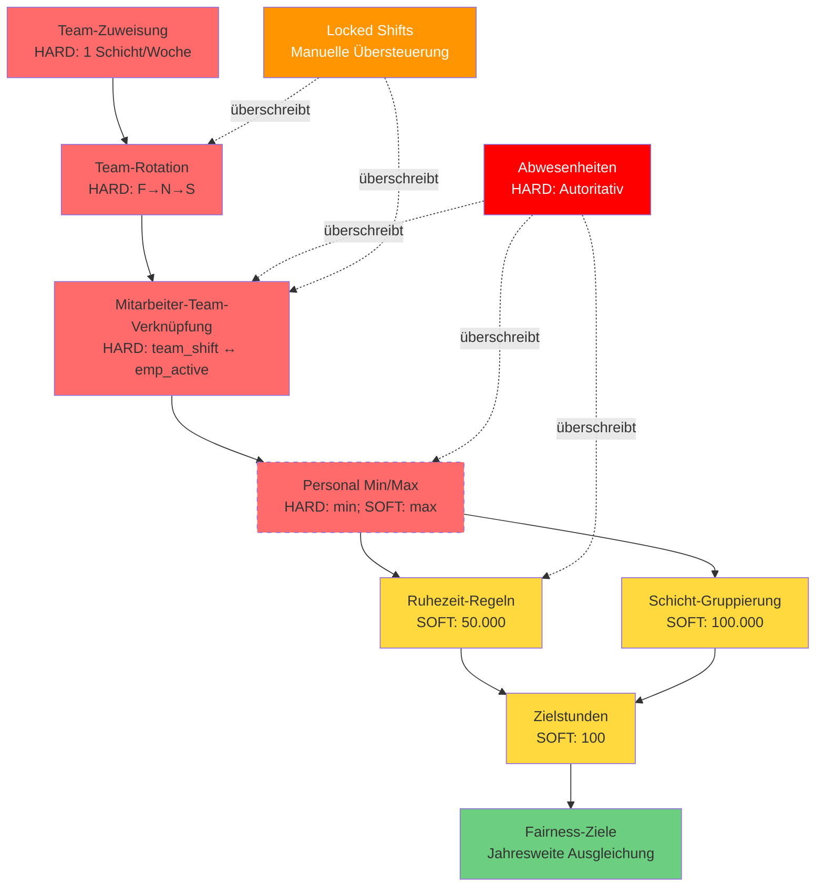

# Schichtplanungs-Regeln und Abhängigkeiten

## 📋 Übersicht

Dieses Dokument beschreibt alle Regeln, Abhängigkeiten und Prioritäten des automatischen Schichtplanungssystems. Das System basiert auf einem **Team-orientierten** Modell mit Constraint-Programming (OR-Tools CP-SAT).

---

## 🔴 HARTE CONSTRAINTS (Hard Constraints)

**Harte Constraints** dürfen **NIEMALS** verletzt werden. Das System findet keine Lösung, wenn diese nicht erfüllt werden können.

| # | Regelname | Beschreibung | Implementierung | Datei |
|---|-----------|--------------|-----------------|-------|
| H1 | **Team-Schicht-Zuweisung** | Jedes Team muss **GENAU EINE** Schicht pro Woche haben | `sum(team_shift[team][week][shift]) == 1` | constraints.py:52 |
| H2 | **Team-Rotation** | Teams folgen ihrer konfigurierten Rotationsgruppe aus der Datenbank (Standard: **F → N → S**) | Rotationsindex = `(ISO_Woche + Team_Index) % Anzahl_Schichten`<br>Rotationsmuster aus DB: `RotationGroups` Tabelle | constraints.py:110-219 |
| H3 | **Mindestbesetzung** | Jede Schicht muss Mindestpersonalstärke erreichen | Dynamisch aus DB gelesen:<br>`ShiftType.min_staff_weekday/weekend` | constraints.py:800 |
| H4 | **Verbotene Übergänge** | Verhinderung unzureichender Ruhezeiten (Soft Constraint: Gewicht 50.000/5.000) | **S→F** (nur 8h Ruhe)<br>**N→F** (0h Ruhe)<br>Basierend auf Schicht-Endzeiten, nicht Rotationsgruppen | constraints.py:1309-1536 |
| H5 | **Keine Schichten bei Abwesenheit** | Keine Schichtzuweisung während Urlaub/Krankheit (U/AU/L) | Alle Schicht-Variablen = 0 während Abwesenheit | constraints.py:1200 |
| H6 | **Maximal eine Schicht pro Tag** | Mitarbeiter kann nur eigene Team-Schicht ODER Cross-Team-Schicht arbeiten | `team_shift[emp] + cross_team_shift[emp] ≤ 1` | constraints.py:650 |
| H7 | **Team-Schicht-Erlaubnis** | Teams dürfen nur zugewiesene Schichttypen arbeiten | Basiert auf `TeamShiftAssignments` Konfiguration | constraints.py:50-108 |
| H8 | **Rotation-Gruppen** | *(Siehe H2 - zusammengeführt)* | Datenbankgesteuert über `RotationGroups` und `RotationGroupShifts` Tabellen | constraints.py:110-219 |

---

## 🟡 WEICHE CONSTRAINTS (Soft Constraints)

**Weiche Constraints** sind Präferenzen, die nach Möglichkeit erfüllt werden sollten, aber bei Konflikten verletzt werden können. Sie werden über **Strafgewichte (Penalty Weights)** priorisiert.

### Prioritätshierarchie (Höchste zu Niedrigste)

| Rang | Constraint | Gewicht | Priorität | Zweck | Datei |
|------|-----------|---------|-----------|-------|-------|
| 🥇 1 | **Schicht-Sequenz-Gruppierung** | 500.000 | ULTRA_KRITISCH | Verhindert A-B-B-A Sandwich-Muster (z.B. F-N-N-F) | constraints.py:1800 |
| 🥈 2 | **Schicht-Isolation** | 100.000 | KRITISCH | Verhindert isolierte Einzelschichten (z.B. S-S-F-S-S Muster) | constraints.py:1900 |
| 🥉 3 | **Ruhezeit-Verletzungen** | 50.000 (Wochentag)<br>5.000 (So-Mo) | KRITISCH | Erzwingt 11-Stunden Mindestruhe (S→F, N→F) | constraints.py:2000 |
| 4 | **Rotation-Reihenfolge** | 10.000 | SEHR_HOCH | Erzwingt Team-Rotationssequenz (aus Rotationsgruppen-DB, Standard: F→N→S) | constraints.py:221-393 |
| 5 | **Zielstunden-Erreichung** | 100 | KRITISCH | **DYNAMISCH berechnet**: Mitarbeiter müssen Zielstunden erreichen: `(weekly_hours/7) × Kalendertage ohne Abwesenheit`<br>- Jan (31T, 48h/W): 212.57h<br>- Feb (28T, 48h/W): 192h<br>- Anpassbar an verschiedene Wochenstunden pro Schichttyp | constraints.py:2916-3066 |
| 6 | **Min. aufeinanderfolgende Wochentage** | 8.000 | SEHR_HOCH | Mindestens 2 aufeinanderfolgende Tage Mo-Fr | constraints.py:2200 |
| 7 | **Max. aufeinanderfolgende Schichten** | 6.000 | SEHR_HOCH | Begrenzt aufeinanderfolgende Arbeitstage pro Schicht | constraints.py:2300 |
| 8 | **Schicht-Hopping** | 200 | HOCH | Verhindert schnelle Schichtwechsel | constraints.py:2500 |
| 9 | **Tägliches Schichtverhältnis** | 200 | HOCH | Erzwingt F ≥ S ≥ N Reihenfolge | constraints.py:2600 |
| 10 | **Cross-Shift Kapazität** | 150 | HOCH | Verhindert Überbelegung bei freien Plätzen | constraints.py:2700 |
| 11 | **Wöchentliches Schichttyp-Limit** | 500 | MITTEL | Max. **2** verschiedene Schichttypen pro Mitarbeiter pro Woche | constraints.py:2270-2393 |
| 12 | **Nacht-Team-Konsistenz** | 600 | MITTEL | Erhält Team-Zusammenhalt bei Nachtschichten | constraints.py:3000 |
| 13 | **Wochenend-Konsistenz** | 300 | MITTEL | Wochenendschichten entsprechen Wochen-Schichttyp des Teams | constraints.py:3100 |
| 14 | **Wochentag-Unterbesetzung** | 18-45* | MITTEL | Ermutigt Lückenfüllung (skaliert nach max_staff) | constraints.py:3200 |
| 15 | **Team-Priorität** | 50 | MITTEL | Bevorzugt eigene Team-Zuweisung vor Cross-Team | constraints.py:3300 |
| 16 | **Wochenend-Überbesetzung** | 50 | NIEDRIG | Verhindert Wochenend-Überbesetzung | constraints.py:3400 |
| 17 | **Schichtpräferenz** | ±25 | NIEDRIG | Belohnt hohe Kapazität, bestraft niedrige | constraints.py:3500 |
| 18 | **Wochentag-Überbesetzung** | 1 | MINIMAL | Erlaubt bei Bedarf für Zielstunden | constraints.py:3600 |

*Berechnet: `5 × (max_staff / min_max_staff) × 4.5`

---

## 🔄 Konfliktlösungsstrategien

### 1. Strafgewicht-Hierarchie

Das System verwendet ein **gewichtetes Strafsystem**:
- Höhere Gewichte = Höhere Priorität (werden zuerst gelöst)
- Constraints mit 100x+ Unterschied werden fast nie kompromittiert
- Beispiel: Isolation (100.000) >> Stunden-Unterschreitung (100)

**Kompromiss-Verhalten:**
```
ULTRA_KRITISCH (500.000):  Fast unmöglich zu verletzen
KRITISCH (50.000-100.000): Nur bei extrem schwierigen Szenarien verletzt
SEHR_HOCH (6.000-10.000):  Selten verletzt, aber möglich
HOCH (150-200):            Wird kompromittiert für höhere Prioritäten
MITTEL (50-600):           Häufig verletzt bei Konflikten
NIEDRIG (1-50):            Oft verletzt, nur "Nice-to-have"
```

### 2. Zeitliche Gewichtung

**Wochenend-Überbesetzung**: Wird stärker bestraft spät im Monat
- Früher Monat: 0,5× Gewicht
- Mitte Monat: 1,0× Gewicht  
- Später Monat: 2,0× Gewicht
- **Zweck**: Flexibilität früh, Effizienz spät

**Wochentag-Unterbesetzung**: Wird stärker bestraft früh im Monat
- **Zweck**: Lücken früh füllen bevorzugt

**Fairness-Ziele**: Jahresweite Ausgleichung
- System verfolgt Gesamtarbeitszeiten über das Jahr
- Mitarbeiter mit weniger irregulären Schichten werden bevorzugt zugewiesen

### 3. Kapazitätsbasierte Ordnung

Bei mehreren Schichten, die Personal benötigen:

1. **Fülle zuerst höchste Kapazitätsschichten** (F > S > N)
2. **Überbesetze niedrige Kapazität nur**, wenn höhere voll sind
3. **Beispiel**: N-Schicht überschreitet max nicht, wenn F/S freie Plätze haben

**Implementierung:**
```python
# Cross-Shift Capacity Constraint (Gewicht: 150)
Wenn F Schicht < Max UND N Schicht > Min:
    Bestrafe N-Schicht Überbesetzung
Zweck: Nutze Hochkapazitäts-Slots vor Niedrigkapazitäts-Slots
```

### 4. Mitarbeiter-Abwesenheits-Priorität

**Prüfreihenfolge für jeden Tag:**
```
PRIORITÄT 1: ❌ Ist Mitarbeiter abwesend? (U/AU/L) → HÖCHSTE
    ↓ Wenn NEIN
PRIORITÄT 2: 🔧 Hat Mitarbeiter TD (Tagdienst)?
    ↓ Wenn NEIN
PRIORITÄT 3: 👷 Hat Mitarbeiter Schichtzuweisung?
    ↓ Wenn NEIN
PRIORITÄT 4: 🏠 Markiere als FREI
```

**Wichtig**: Abwesenheiten sind **AUTORITATIV** und überschreiben:
- Reguläre Schichten (F, S, N)
- TD (Tagdienst)
- Jede andere Zuweisung

### 5. Fairness-Ausgleichung

**Block-Planung**:
- Ermutigt vollständige aufeinanderfolgende Arbeitsblöcke
- Bonus-Belohnungen (negative Strafen) für komplette Blöcke
- Verhindert fragmentierte Planung

**Jahres-Fairness-Matrix**:
- Verfolgt jährliche Verteilung irregulärer Schichten
- Bevorzugt Mitarbeiter mit weniger Wochenend-/Nachtschichten YTD
- Gleicht aus über mehrere Planungsperioden

---

## 📊 Abhängigkeiten-Topologie

### Hierarchische Struktur



**Legende:**
- 🔴 **Rot (durchgezogen)**: Harte Constraints
- 🟡 **Gelb**: Kritische weiche Constraints (50.000+)
- 🟢 **Grün**: Optimierungsziele
- 🟠 **Orange**: Manuelle Übersteuerungen
- 🔴 **Dunkelrot**: Absolute Priorität (Abwesenheiten)

---

## 🔀 Constraint-Anwendungs-Ablauf

```mermaid
flowchart TD
    Start([Start: Planungsperiode]) --> Load[Lade Daten:<br/>Teams, Mitarbeiter, Abwesenheiten]
    Load --> Init[Initialisiere Modell<br/>OR-Tools CP-SAT]
    
    Init --> H1[HARD 1: Team-Schicht-Zuweisung<br/>1 Schicht/Team/Woche]
    H1 --> H2[HARD 2: Team-Rotation<br/>F→N→S Muster]
    H2 --> H3[HARD 3: Mitarbeiter↔Team<br/>Verknüpfung]
    H3 --> H4[HARD 4: Mindestbesetzung<br/>Min staff requirements]
    H4 --> H5[HARD 5: Abwesenheiten<br/>Keine Schichten bei U/AU/L]
    H5 --> H6[HARD 6: Max 1 Schicht/Tag<br/>Own OR Cross-Team]
    H6 --> H7[HARD 7: Mindeststunden pro Monat<br/>192h + proportionales Ziel]
    
    H7 --> Lock[Wende Locked Shifts an<br/>Manuelle Übersteuerungen]
    
    Lock --> S1[SOFT: Sequenz-Gruppierung<br/>500.000]
    S1 --> S2[SOFT: Schicht-Isolation<br/>100.000]
    S2 --> S3[SOFT: Ruhezeit<br/>50.000]
    S3 --> S4[SOFT: Rotation-Ordnung<br/>10.000]
    S4 --> S5[SOFT: Min. aufeinanderfolgende<br/>8.000]
    S5 --> S6[SOFT: Max. aufeinanderfolgende<br/>6.000]
    S6 --> S7[SOFT: Weitere Constraints<br/>200-600]
    S7 --> S8[SOFT: Zielstunden<br/>100]
    S8 --> S9[SOFT: Team-Priorität<br/>50]
    S9 --> S10[SOFT: Fairness & Präferenzen<br/>1-50]
    
    S10 --> Obj[Definiere Zielfunktion:<br/>Minimize Σ penalties]
    Obj --> Solve{Solve CP-SAT}
    
    Solve -->|Lösung gefunden| Extract[Extrahiere Schichtzuweisungen]
    Solve -->|Keine Lösung| Relax[Lockere weiche Constraints<br/>beginnend mit niedrigsten Gewichten]
    
    Relax --> Solve
    
    Extract --> Validate[Validiere Lösung:<br/>Prüfe alle harten Constraints]
    Validate --> Done([Ende: Plan erstellt])
    
    style Start fill:#6bcf7f
    style Done fill:#6bcf7f
    style H1 fill:#ff6b6b
    style H2 fill:#ff6b6b
    style H3 fill:#ff6b6b
    style H4 fill:#ff6b6b
    style H5 fill:#ff6b6b
    style H6 fill:#ff6b6b
    style H7 fill:#ff6b6b
    style S1 fill:#ffd93d
    style S2 fill:#ffd93d
    style S3 fill:#ffd93d
    style S4 fill:#ffd93d
    style S5 fill:#ffd93d
    style S6 fill:#ffd93d
    style S7 fill:#ffd93d
    style S8 fill:#ffd93d
    style S9 fill:#ffd93d
    style S10 fill:#ffd93d
    style Lock fill:#ff9500
    style Solve fill:#4ecdc4
```



---

## 🎯 Regel-Interaktions-Matrix

| Regel A | Regel B | Konfliktart | Auflösung | Gewinner |
|---------|---------|-------------|-----------|----------|
| **Mindestbesetzung (H)** | **Max Wochenstunden (H)** | Nicht genug Mitarbeiter verfügbar | Keine - beide sind hart | System findet keine Lösung |
| **Abwesenheit (H)** | **Mindestbesetzung (H)** | Abwesenheit reduziert verfügbares Personal | Springer aktiviert, Notification | **Abwesenheit** (absolut) |
| **Ruhezeit (50k)** | **Zielstunden (100)** | Mitarbeiter braucht Stunden, aber Ruhezeit verletzt | Ruhezeit-Verletzung bestraft härter | **Ruhezeit** (500:1 Verhältnis) |
| **Schicht-Isolation (100k)** | **Zielstunden (100)** | Stunden erreichen würde isolierte Schicht erstellen | Isolation viel stärker bestraft | **Anti-Isolation** (1000:1) |
| **Cross-Team (50)** | **Zielstunden (100)** | Mitarbeiter braucht Cross-Team für Stunden | Zielstunden wichtiger | **Zielstunden** (2:1) |
| **Wochenend-Überbesetzung (50)** | **Zielstunden (100)** | Stunden erreichen erfordert Wochenend-Zuweisung | Zielstunden wichtiger | **Zielstunden** (2:1) |
| **Rotation F→N→S (10k)** | **Locked Shift (∞)** | Manuelle Zuweisung durchbricht Rotation | Locked Shifts sind absolut | **Locked Shift** |
| **Team-Priorität (50)** | **Mindestbesetzung (H)** | Eigenes Team bevorzugt, aber Min nicht erreicht | Harter Constraint überschreibt | **Mindestbesetzung** |
| **Fairness (Jahr)** | **Zielstunden (100)** | Fair verteilen vs. aktuelle Periode erfüllen | Aktuelle Periode wichtiger | **Zielstunden** |
| **Nacht-Team-Konsistenz (600)** | **Mindestbesetzung (H)** | Team zusammenhalten vs. Min staff | Harter Constraint überschreibt | **Mindestbesetzung** |

---

## 🔧 Spezielle Regelkonfigurationen

### Schichttyp-spezifische Einstellungen

Das System basiert auf einem **3-Schicht-Rotationssystem** mit den folgenden Hauptschichten:

| Schichttyp | Max aufeinanderfolgende Tage | Arbeitstage | Wochenstunden | Besonderheiten |
|------------|----------------------------|-------------|---------------|----------------|
| **F (Früh)** | 6 | Mo-So | 48h | Höchste Kapazität, bevorzugt |
| **S (Spät)** | 6 | Mo-So | 48h | Mittlere Kapazität |
| **N (Nacht)** | 3 | Mo-So | 48h | Niedrigste Kapazität, nur wenn nötig |

**Hinweis**: Zusätzliche Schichttypen können bei Bedarf manuell über die Benutzeroberfläche erstellt werden. Das Kern-System ist jedoch auf die drei oben genannten Schichten ausgelegt, die in einem F → N → S Rotationsmuster organisiert sind.

### Rotationsgruppen-Konfiguration

| Rotationsgruppe | Schichtfolge | Teilnehmende Teams | Zykluslänge |
|-----------------|--------------|-------------------|-------------|
| **3-Schicht-System** | F → N → S | Teams 1-3 | 3 Wochen |
| **Benutzerdefiniert** | Datenbankgesteuert | Beliebig | Variabel |

Rotationsmuster werden in der Tabelle `RotationGroupShifts` konfiguriert und können pro Team angepasst werden.

---

## 📈 Optimierungsziele

Das Solver-System **minimiert** eine gewichtete Summe von:

```
Minimize(
    Σ(Constraint-Strafen × Gewichte) +
    Σ(Stunden-Unterschreitung × 100) +
    Σ(Fairness-Abweichungen × Zeitfaktor) +
    Σ(Überbesetzung × Zeitfaktor)
)
```

### Detaillierte Formel

```
Total_Cost = 
    500.000 × Sequenz_Gruppierung_Verletzungen +
    100.000 × Isolation_Verletzungen +
     50.000 × Ruhezeit_Verletzungen +
     10.000 × Rotation_Ordnung_Verletzungen +
      8.000 × Min_Aufeinanderfolgende_Verletzungen +
      6.000 × Max_Aufeinanderfolgende_Verletzungen +
        600 × Nacht_Team_Konsistenz_Verletzungen +
        500 × Schichttyp_Limit_Verletzungen +
        300 × Wochenend_Konsistenz_Verletzungen +
        200 × Schicht_Hopping_Verletzungen +
        200 × Tägliches_Verhältnis_Verletzungen +
        150 × Cross_Shift_Kapazität_Verletzungen +
        100 × Zielstunden_Unterschreitung +
         50 × Cross_Team_Zuweisungen +
         50 × (Wochenend_Überbesetzung × Zeit_Faktor) +
    18-45  × Wochentag_Unterbesetzung +
        ±25 × Schichtpräferenz_Abweichungen +
          1 × Wochentag_Überbesetzung +
    Fairness_Jahr_Abweichungen
```

---

## 💡 Wichtige Hinweise

### Datenbankgesteuerte Regeln

Mehrere Regeln werden dynamisch aus der Datenbank geladen:
- **Min/Max Personal pro Schicht**: `ShiftType.min_staff_weekday/weekend`, `max_staff_weekday/weekend`
- **Max aufeinanderfolgende Tage**: `ShiftType.max_consecutive_days`
- **Rotationsmuster**: `RotationGroup` und `RotationGroupShift` Tabellen
- **Team-Schicht-Erlaubnis**: `TeamShiftAssignments` Tabelle
- **Wochenstunden**: `ShiftType.weekly_working_hours`
- **Globale Einstellungen**: `GlobalSettings` Tabelle (Ruhezeit, Max consecutive)

### Manuelle Übersteuerungen (Locked Shifts)

- **Locked Shifts** haben **absolute Priorität**
- Sie überschreiben:
  - Team-Rotation
  - Mitarbeiter-Team-Verknüpfung
  - Weiche Constraints
- Sie respektieren:
  - Abwesenheiten (noch höhere Priorität)
  - Harte Constraints (Min/Max Stunden, Max 1 Schicht/Tag)

### Springer-System

Bei Unterbesetzung durch Abwesenheiten:
1. System aktiviert automatisch **Springer-Benachrichtigung**
2. Springer (Ferienjobber) werden für Vertretung kontaktiert
3. Manuelle Zuweisung durch Disponenten erforderlich

### Fairness über Jahr

Das System verfolgt:
- **Gesamtarbeitszeiten** pro Mitarbeiter YTD
- **Wochenendschichten** pro Mitarbeiter YTD
- **Nachtschichten** pro Mitarbeiter YTD
- **Irreguläre Schichten** (außerhalb normaler Rotation)

Bevorzugt bei Zuweisungen:
- Mitarbeiter mit **weniger** Wochenend-/Nachtschichten
- Mitarbeiter mit **niedrigeren** Gesamtstunden (innerhalb Zielbereich)

---

## 🔐 Sonderfälle und Ausnahmen

### Grenzwochen-Behandlung (Boundary Weeks)

**Problem**: Wenn Schichtkonfigurationen (z.B. Maximale Mitarbeiter pro Schicht) zwischen Planungsperioden geändert werden, können bereits geplante Zuweisungen die neuen Constraints verletzen.

**Beispiel**:
- Februar 2026 wurde geplant, als N-Schicht max=5 war
- N-Schicht max wurde später auf 3 reduziert
- März 2026 Planung erweitert zurück bis 23. Februar (Grenzwoche)
- Bestehende Zuweisungen vom 23. Feb haben 5 Mitarbeiter auf N-Schicht
- System versucht alte Zuweisungen (5) UND neue Limits (3) zu respektieren → **INFEASIBLE**

**Lösung** (implementiert in `web_api.py`, Zeilen 2943-2986):

1. **Grenzwochen-Erkennung**: Identifiziert Wochen, die Monatsgrenzen überspannen
   - Woche enthält Daten VOR dem Planungsmonat UND innerhalb des Monats
   - Woche enthält Daten innerhalb des Monats UND NACH dem Monat

2. **Überspringe Mitarbeiter-Locks**: Mitarbeiterzuweisungen in Grenzwochen werden NICHT gelockt
   - Erlaubt komplette Neuplanung mit aktueller Konfiguration
   - Verhindert Konflikte durch veraltete Zuweisungen
   - Team-Locks werden ebenfalls übersprungen (bereits existierende Logik)

3. **Bewahre Nicht-Grenzwochen**: Zuweisungen außerhalb von Grenzwochen bleiben gelockt
   - Nur Wochen, die Grenzen überspannen, werden neu geplant
   - Sichert Kontinuität wo möglich

**Beispiel für März 2026**:
```
Planungszeitraum: 1. März - 31. März
Erweitert: 23. Februar (Mo) - 5. April (So)

- Woche 0 (23. Feb - 1. März): Grenzwoche → Mitarbeiter-Locks ÜBERSPRUNGEN
- Wochen 1-4 (2. März - 29. März): Aktueller Monat → Wird geplant
- Woche 5 (30. März - 5. April): Grenzwoche → Mitarbeiter-Locks ÜBERSPRUNGEN
```

**Vorteil**: System kann sich an Konfigurationsänderungen anpassen ohne manuelle Eingriffe

**Wichtig**: Diese Lösung ändert KEINE Kern-Constraints:
- ✅ 192h Mindeststunden bleiben HART (wie zuvor)
- ✅ Alle anderen Constraints unverändert
- ✅ Nur Locking-Verhalten in Grenzwochen betroffen

---

## 📚 Verwandte Dokumentation

- **ALGORITHMUS_BESTAETIGUNG.md**: Algorithmus-Verifikation und Testzusammenfassung
- **DOKUMENTATION.md**: Allgemeine System-Dokumentation
- **ARCHITECTURE.md**: System-Architektur und Komponenten
- **Verschiedene FIX-Dokumente**: Detaillierte Erklärungen spezifischer Regeländerungen

---

## 🔄 Versions-Historie

| Version | Datum | Änderungen |
|---------|-------|-----------|
| 1.3 | 2026-02-07 | **Dokumentations-Aktualisierung**: Entfernung veralteter Schichttypen (ZD, BMT, BSB) aus der Tabelle. Diese Legacy-Typen stammen aus sehr frühen Versionen und sind nicht Teil des aktuellen 3-Schicht-Rotationssystems (F, S, N). |
| 1.2 | 2026-02-07 | **Korrektur**: 192h Constraint von HART auf WEICH korrigiert (wie in PR #122 ursprünglich implementiert). Dynamische Berechnung basierend auf `(weekly_hours/7) × Kalendertage` wiederhergestellt. |
| 1.1 | 2026-02-07 | Grenzwochen-Behandlung für Konfigurationsänderungen hinzugefügt |
| 1.0 | 2026-02-06 | Initiale Erstellung der Regel-Dokumentation |

---

**Erstellt**: 2026-02-06  
**Datei**: `SCHICHTPLANUNGS_REGELN.md`  
**System**: OR-Tools CP-SAT Constraint Programming  
**Sprache**: Python 3.x
