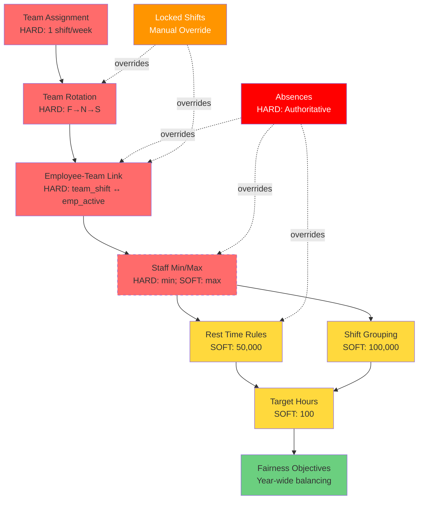

# Shift Planning Rules and Dependencies

## 📋 Overview

This document describes all rules, dependencies, and priorities of the automatic shift planning system. The system is based on a **team-oriented** model using Constraint Programming (OR-Tools CP-SAT).

---

## 🔴 HARD CONSTRAINTS

**Hard Constraints** must **NEVER** be violated. The system cannot find a solution if these cannot be satisfied.

| # | Rule Name | Description | Implementation | File |
|---|-----------|-------------|----------------|------|
| H1 | **Team Shift Assignment** | Each team must have **EXACTLY ONE** shift per week | `sum(team_shift[team][week][shift]) == 1` | constraints.py:52 |
| H2 | **Team Rotation** | Teams follow fixed rotation pattern: **F → N → S** | Rotation index = `(week + team_id) % 3` | constraints.py:120 |
| H3 | **Minimum Staffing** | Each shift must meet minimum staff requirements | **Weekday**: F≥4, S≥3, N≥3<br>**Weekend**: ≥2 | constraints.py:800 |
| H4 | **Forbidden Transitions** | Prevent inadequate rest periods | **S→F forbidden** (only 8h rest)<br>**N→F forbidden** (0h rest)<br>**N→S forbidden** (8h rest) | constraints.py:40-43 |
| H5 | **No Shifts During Absence** | No shift assignment during vacation/sick leave (U/AU/L) | All shift variables = 0 during absence | constraints.py:1200 |
| H6 | **Maximum One Shift Per Day** | Employee can only work own team shift OR cross-team shift | `team_shift[emp] + cross_team_shift[emp] ≤ 1` | constraints.py:650 |
| H7 | **TD Restriction** | Maximum 1 day duty (TD/BMT/BSB) per employee per week | `sum(td_assignments[emp][week]) ≤ 1` | constraints.py:1500 |
| H8 | **Maximum Weekly Hours** | Not more than 48 hours per week | Scales by `hours_per_day × work_days` | constraints.py:1100 |
| H9 | **Team Shift Permission** | Teams can only work assigned shift types | Based on `TeamShiftAssignments` configuration | constraints.py:89 |
| H10 | **Rotation Groups** | Teams follow their configured rotation group | Database-driven or default F→N→S | constraints.py:145 |

---

## 🟡 SOFT CONSTRAINTS

**Soft Constraints** are preferences that should be satisfied if possible, but can be violated during conflicts. They are prioritized using **penalty weights**.

### Priority Hierarchy (Highest to Lowest)

| Rank | Constraint | Weight | Priority | Purpose | File |
|------|-----------|--------|----------|---------|------|
| 🥇 1 | **Shift Sequence Grouping** | 500,000 | ULTRA_CRITICAL | Prevents A-B-B-A sandwich patterns (e.g., F-N-N-F) | constraints.py:1800 |
| 🥈 2 | **Shift Isolation** | 100,000 | CRITICAL | Prevents isolated single shifts (e.g., S-S-F-S-S pattern) | constraints.py:1900 |
| 🥉 3 | **Rest Time Violations** | 50,000 (weekday)<br>5,000 (Sun-Mon) | CRITICAL | Enforces 11-hour minimum rest (S→F, N→F) | constraints.py:2000 |
| 4 | **Rotation Order** | 10,000 | VERY_HIGH | Enforces team rotation sequence F→N→S | constraints.py:250 |
| 5 | **Min Consecutive Weekdays** | 8,000 | VERY_HIGH | Minimum 2 consecutive days Mon-Fri | constraints.py:2200 |
| 6 | **Max Consecutive Shifts** | 6,000 | VERY_HIGH | Limits consecutive working days per shift | constraints.py:2300 |
| 7 | **Shift Hopping** | 200 | HIGH | Prevents rapid shift changes | constraints.py:2500 |
| 8 | **Daily Shift Ratio** | 200 | HIGH | Enforces F ≥ S ≥ N ordering | constraints.py:2600 |
| 9 | **Cross-Shift Capacity** | 150 | HIGH | Prevents overstaffing low-capacity shifts when high-capacity have space | constraints.py:2700 |
| 10 | **Target Hours Shortage** | 100 | CRITICAL | Employees must reach 192h monthly minimum | constraints.py:2800 |
| 11 | **Weekly Shift Type Limit** | 500 | MEDIUM | Max 2-3 different shift types per employee per week | constraints.py:2900 |
| 12 | **Night Team Consistency** | 600 | MEDIUM | Maintains team cohesion in night shifts | constraints.py:3000 |
| 13 | **Weekend Consistency** | 300 | MEDIUM | Weekend shifts match team's weekly shift type | constraints.py:3100 |
| 14 | **Weekday Understaffing** | 18-45* | MEDIUM | Encourages gap filling (scaled by max_staff) | constraints.py:3200 |
| 15 | **Team Priority** | 50 | MEDIUM | Prefers own-team assignment over cross-team | constraints.py:3300 |
| 16 | **Weekend Overstaffing** | 50 | LOW | Discourages weekend overstaffing | constraints.py:3400 |
| 17 | **Shift Preference** | ±25 | LOW | Rewards high-capacity shifts, penalizes low-capacity | constraints.py:3500 |
| 18 | **Weekday Overstaffing** | 1 | MINIMAL | Allows if needed for target hours | constraints.py:3600 |

*Calculated: `5 × (max_staff / min_max_staff) × 4.5`

---

## 🔄 Conflict Resolution Strategies

### 1. Penalty Weight Hierarchy

The system uses a **weighted penalty system**:
- Higher weights = Higher priority (solved first)
- Constraints with 100x+ difference are rarely compromised
- Example: Isolation (100,000) >> Hours Shortage (100)

**Compromise Behavior:**
```
ULTRA_CRITICAL (500,000):   Nearly impossible to violate
CRITICAL (50,000-100,000):  Only violated in extremely difficult scenarios
VERY_HIGH (6,000-10,000):   Rarely violated, but possible
HIGH (150-200):             Compromised for higher priorities
MEDIUM (50-600):            Frequently violated in conflicts
LOW (1-50):                 Often violated, "nice-to-have" only
```

### 2. Temporal Weighting

**Weekend Overstaffing**: Penalized MORE heavily late in the month
- Early month: 0.5× weight
- Mid month: 1.0× weight
- Late month: 2.0× weight
- **Purpose**: Flexibility early, efficiency late

**Weekday Understaffing**: Penalized MORE heavily early in the month
- **Purpose**: Prefer filling gaps early

**Fairness Objectives**: Year-wide balancing
- System tracks total work hours across the year
- Employees with fewer irregular shifts are preferred for assignments

### 3. Capacity-Based Ordering

When multiple shifts need staffing:

1. **Fill highest-capacity shifts first** (F > S > N)
2. **Overstuff low-capacity only** if higher-capacity are full
3. **Example**: N shift won't exceed max if F/S have empty slots

**Implementation:**
```python
# Cross-Shift Capacity Constraint (Weight: 150)
If F shift < Max AND N shift > Min:
    Penalize N shift overstaffing
Purpose: Use high-capacity slots before low-capacity slots
```

### 4. Employee Absence Priority

**Check order for each day:**
```
PRIORITY 1: ❌ Is employee absent? (U/AU/L) → HIGHEST
    ↓ If NO
PRIORITY 2: 🔧 Does employee have TD (day duty)?
    ↓ If NO
PRIORITY 3: 👷 Does employee have shift assignment?
    ↓ If NO
PRIORITY 4: 🏠 Mark as OFF
```

**Important**: Absences are **AUTHORITATIVE** and override:
- Regular shifts (F, S, N)
- TD (day duty)
- Any other assignment

### 5. Fairness Balancing

**Block Scheduling**:
- Encourages complete consecutive work blocks
- Bonus rewards (negative penalties) for complete blocks
- Prevents fragmented planning

**Year-wide Fairness Matrix**:
- Tracks annual distribution of irregular shifts
- Prefers employees with fewer weekend/night shifts YTD
- Balances across multiple planning periods

---

## 📊 Dependencies Topology

### Hierarchical Structure



**Legend:**
- 🔴 **Red (solid)**: Hard constraints
- 🟡 **Yellow**: Critical soft constraints (50,000+)
- 🟢 **Green**: Optimization objectives
- 🟠 **Orange**: Manual overrides
- 🔴 **Dark Red**: Absolute priority (absences)

---

## 🔀 Constraint Application Flow

```mermaid
flowchart TD
    Start([Start: Planning Period]) --> Load[Load Data:<br/>Teams, Employees, Absences]
    Load --> Init[Initialize Model<br/>OR-Tools CP-SAT]
    
    Init --> H1[HARD 1: Team Shift Assignment<br/>1 shift/team/week]
    H1 --> H2[HARD 2: Team Rotation<br/>F→N→S pattern]
    H2 --> H3[HARD 3: Employee↔Team<br/>Linkage]
    H3 --> H4[HARD 4: Minimum Staffing<br/>Min staff requirements]
    H4 --> H5[HARD 5: Absences<br/>No shifts during U/AU/L]
    H5 --> H6[HARD 6: Max 1 Shift/Day<br/>Own OR Cross-Team]
    H6 --> H7[HARD 7: TD Restriction<br/>Max 1/week]
    H7 --> H8[HARD 8: Max Weekly Hours<br/>48h limit]
    
    H8 --> Lock[Apply Locked Shifts<br/>Manual Overrides]
    
    Lock --> S1[SOFT: Sequence Grouping<br/>500,000]
    S1 --> S2[SOFT: Shift Isolation<br/>100,000]
    S2 --> S3[SOFT: Rest Time<br/>50,000]
    S3 --> S4[SOFT: Rotation Order<br/>10,000]
    S4 --> S5[SOFT: Min Consecutive<br/>8,000]
    S5 --> S6[SOFT: Max Consecutive<br/>6,000]
    S6 --> S7[SOFT: Other Constraints<br/>200-600]
    S7 --> S8[SOFT: Target Hours<br/>100]
    S8 --> S9[SOFT: Team Priority<br/>50]
    S9 --> S10[SOFT: Fairness & Preferences<br/>1-50]
    
    S10 --> Obj[Define Objective:<br/>Minimize Σ penalties]
    Obj --> Solve{Solve CP-SAT}
    
    Solve -->|Solution found| Extract[Extract Shift Assignments]
    Solve -->|No solution| Relax[Relax Soft Constraints<br/>starting with lowest weights]
    
    Relax --> Solve
    
    Extract --> Validate[Validate Solution:<br/>Check all hard constraints]
    Validate --> Done([End: Plan Created])
    
    style Start fill:#6bcf7f
    style Done fill:#6bcf7f
    style H1 fill:#ff6b6b
    style H2 fill:#ff6b6b
    style H3 fill:#ff6b6b
    style H4 fill:#ff6b6b
    style H5 fill:#ff6b6b
    style H6 fill:#ff6b6b
    style H7 fill:#ff6b6b
    style H8 fill:#ff6b6b
    style S1 fill:#ffd93d
    style S2 fill:#ffd93d
    style S3 fill:#ffd93d
    style S4 fill:#ffd93d
    style S5 fill:#ffd93d
    style S6 fill:#ffd93d
    style S7 fill:#ffd93d
    style S8 fill:#ffd93d
    style S9 fill:#ffd93d
    style S10 fill:#ffd93d
    style Lock fill:#ff9500
    style Solve fill:#4ecdc4
```



---

## 🎯 Rule Interaction Matrix

| Rule A | Rule B | Conflict Type | Resolution | Winner |
|--------|--------|---------------|------------|--------|
| **Minimum Staffing (H)** | **Max Weekly Hours (H)** | Not enough employees available | None - both are hard | System finds no solution |
| **Absence (H)** | **Minimum Staffing (H)** | Absence reduces available staff | Springer activated, notification | **Absence** (absolute) |
| **Rest Time (50k)** | **Target Hours (100)** | Employee needs hours but violates rest | Rest violation penalized harder | **Rest Time** (500:1 ratio) |
| **Shift Isolation (100k)** | **Target Hours (100)** | Reaching hours would create isolated shift | Isolation penalized much harder | **Anti-Isolation** (1000:1) |
| **Cross-Team (50)** | **Target Hours (100)** | Employee needs cross-team for hours | Target hours more important | **Target Hours** (2:1) |
| **Weekend Overstaffing (50)** | **Target Hours (100)** | Reaching hours requires weekend assignment | Target hours more important | **Target Hours** (2:1) |
| **Rotation F→N→S (10k)** | **Locked Shift (∞)** | Manual assignment breaks rotation | Locked shifts are absolute | **Locked Shift** |
| **Team Priority (50)** | **Minimum Staffing (H)** | Own team preferred but min not reached | Hard constraint overrides | **Minimum Staffing** |
| **Fairness (Year)** | **Target Hours (100)** | Fair distribution vs. current period | Current period more important | **Target Hours** |
| **Night Team Consistency (600)** | **Minimum Staffing (H)** | Keep team together vs. min staff | Hard constraint overrides | **Minimum Staffing** |

---

## 🔧 Special Rule Configurations

### Shift Type-Specific Settings

| Shift Type | Max Consecutive Days | Work Days | Weekly Hours | Special Notes |
|------------|---------------------|-----------|--------------|---------------|
| **F (Early)** | 6 | Mon-Sun | 48h | Highest capacity, preferred |
| **S (Late)** | 6 | Mon-Sun | 48h | Medium capacity |
| **N (Night)** | 3 | Mon-Sun | 48h | Lowest capacity, only when needed |
| **ZD (Intermediate)** | 6 | Mon-Fri | 40h | Weekdays-only |
| **BMT (Fire Alarm Tech)** | 5 | Mon-Fri | 40h | TD-type, qualified |
| **BSB (Fire Safety Officer)** | 5 | Mon-Fri | 40h (9.5h/day) | TD-type, qualified |

### Rotation Group Configuration

| Rotation Group | Shift Sequence | Participating Teams | Cycle Length |
|----------------|----------------|---------------------|--------------|
| **3-Shift System** | F → N → S | Teams 1-3 | 3 weeks |
| **Custom** | Database-driven | Any | Variable |

Rotation patterns are configured in the `RotationGroupShifts` table and can be customized per team.

---

## 📈 Optimization Objectives

The solver system **minimizes** a weighted sum of:

```
Minimize(
    Σ(constraint_penalties × weights) +
    Σ(hours_shortage × 100) +
    Σ(fairness_deviations × time_factor) +
    Σ(overstaffing × time_factor)
)
```

### Detailed Formula

```
Total_Cost = 
    500,000 × Sequence_Grouping_Violations +
    100,000 × Isolation_Violations +
     50,000 × Rest_Time_Violations +
     10,000 × Rotation_Order_Violations +
      8,000 × Min_Consecutive_Violations +
      6,000 × Max_Consecutive_Violations +
        600 × Night_Team_Consistency_Violations +
        500 × Shift_Type_Limit_Violations +
        300 × Weekend_Consistency_Violations +
        200 × Shift_Hopping_Violations +
        200 × Daily_Ratio_Violations +
        150 × Cross_Shift_Capacity_Violations +
        100 × Target_Hours_Shortage +
         50 × Cross_Team_Assignments +
         50 × (Weekend_Overstaffing × Time_Factor) +
    18-45  × Weekday_Understaffing +
        ±25 × Shift_Preference_Deviations +
          1 × Weekday_Overstaffing +
    Fairness_Year_Deviations
```

---

## 💡 Important Notes

### Database-Driven Rules

Several rules are dynamically loaded from the database:
- **Min/Max staff per shift**: `ShiftType.min_staff_weekday/weekend`, `max_staff_weekday/weekend`
- **Max consecutive days**: `ShiftType.max_consecutive_days`
- **Rotation patterns**: `RotationGroup` and `RotationGroupShift` tables
- **Team shift permissions**: `TeamShiftAssignments` table
- **Weekly hours**: `ShiftType.weekly_working_hours`
- **Global settings**: `GlobalSettings` table (rest time, max consecutive)

### Manual Overrides (Locked Shifts)

- **Locked Shifts** have **absolute priority**
- They override:
  - Team rotation
  - Employee-team linkage
  - Soft constraints
- They respect:
  - Absences (even higher priority)
  - Hard constraints (min/max hours, max 1 shift/day)

### Springer System

When understaffing occurs due to absences:
1. System automatically activates **Springer notification**
2. Springers (temporary workers) are contacted for replacement
3. Manual assignment by dispatchers required

### Fairness Over Year

The system tracks:
- **Total work hours** per employee YTD
- **Weekend shifts** per employee YTD
- **Night shifts** per employee YTD
- **Irregular shifts** (outside normal rotation)

Prefers for assignments:
- Employees with **fewer** weekend/night shifts
- Employees with **lower** total hours (within target range)

---

## 📚 Related Documentation

- **ALGORITHMUS_BESTAETIGUNG.md**: Algorithm verification and test summary
- **DOKUMENTATION.md**: General system documentation
- **ARCHITECTURE.md**: System architecture and components
- **Various FIX documents**: Detailed explanations of specific rule changes

---

## 🔄 Version History

| Version | Date | Changes |
|---------|------|---------|
| 1.0 | 2026-02-06 | Initial creation of rules documentation |

---

**Created**: 2026-02-06  
**File**: `SHIFT_PLANNING_RULES_EN.md`  
**System**: OR-Tools CP-SAT Constraint Programming  
**Language**: Python 3.x
